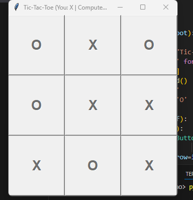

# Tic-Tac-Toe Game with Minimax AI (Python + Tkinter)

Welcome to the classic **Tic-Tac-Toe** game where you play as **X**, and the computer plays as **O** using the **Minimax algorithm** for perfect AI moves. The game is built using Python and Tkinter.



---

## 🛠️ Features

* Interactive graphical interface using Tkinter.
* Turn-based play between user and computer.
* Computer uses **Minimax algorithm** to play optimally.
* Automatically detects a win or draw and resets the board.

---

## 🖥️ How to Run the Game

### ✅ Prerequisites

Make sure you have **Python 3** installed on your system.

You can download Python from [https://www.python.org/downloads/](https://www.python.org/downloads/).

Tkinter usually comes built-in with Python. If not, you can install it:

```bash
pip install tk
```

### 🚀 Run Instructions

1. Save the code in a file, e.g., `tic_tac_toe.py`
2. Open your terminal or command prompt.
3. Navigate to the folder where your file is saved.
4. Run the script:

```bash
python tic_tac_toe.py
```

---

## 🎮 How to Play

1. The user plays as **X**.
2. Click on any empty cell in the 3x3 grid to make your move.
3. After your move, the computer (O) will play automatically.
4. The game ends when:

   * Either player wins.
   * All cells are filled (draw).
5. A pop-up will show the result. The board will reset for a new game.

---

## 🧠 AI Algorithm Used

This game uses the **Minimax Algorithm** for the computer's move selection.

* **Minimax** is a recursive decision-making algorithm used for two-player turn-based games.
* It evaluates all possible moves and picks the one with the best outcome for the AI.
* In this game:

  * AI (Computer) is the **maximizing** player.
  * Human (You) is the **minimizing** player.

This guarantees the computer will **never lose**.

---

## 📁 File Structure

```
tic_tac_toe.py       # Main game file
README.md            # Game instructions and documentation
```

---

## 📌 Notes

* No internet is required to play the game.
* Works on Windows, macOS, and Linux (as long as Python and Tkinter are installed).

---

## 📬 Contact

For any feedback or issues, feel free to reach out!

Happy Playing! 🎮
